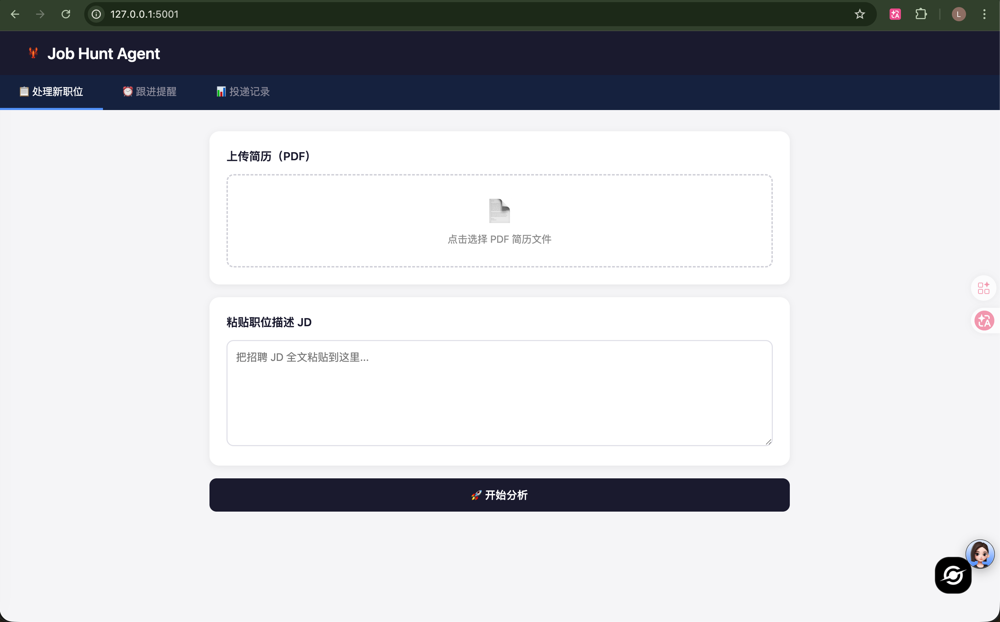
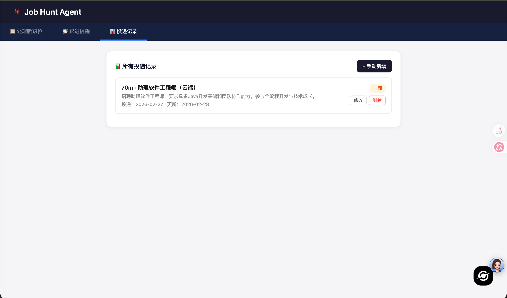
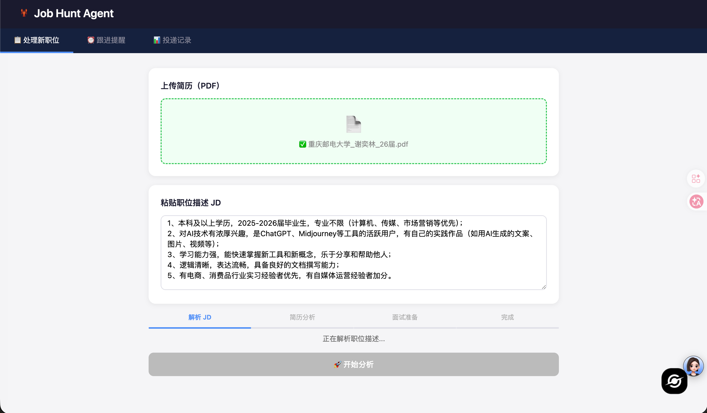
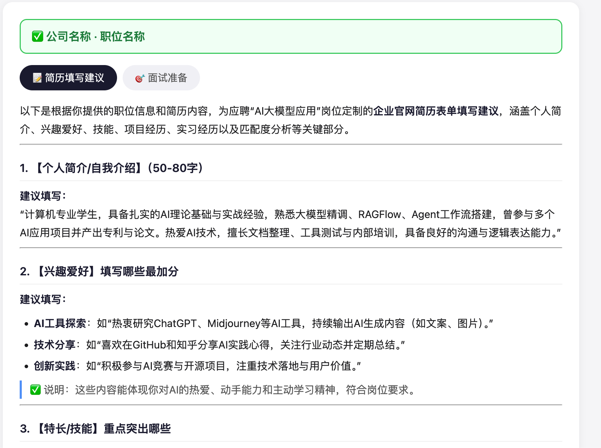

# 🦞 Job Hunt Agent

> AI 驱动的求职助手，自动解析 JD、生成简历填写建议、准备面试题、追踪投递进度。



## ✨ 功能

- **JD 解析**：粘贴职位描述，自动提取核心要求和职责
- **简历匹配建议**：对照 JD 给出企业官网表单的具体填写建议（自我介绍、项目经历、技能等）
- **面试准备清单**：技术题、项目题、综合题、反问环节，全面覆盖
- **投递记录追踪**：记录每个职位的投递状态和跟进提醒
- **跟进提醒**：超过设定天数未更新自动提醒






## 🛠 技术栈

- **后端**：Python + Flask
- **AI**：阿里云通义千问 Qwen-Turbo API
- **前端**：原生 HTML/CSS/JS + Marked.js（Markdown 渲染）
- **存储**：本地 JSON 文件

## 🚀 快速开始

### 1. 克隆项目

```bash
git clone https://github.com/leeeeee10/job-hunt-agent.git
cd job-hunt-agent
```

### 2. 创建虚拟环境

```bash
python3 -m venv venv
source venv/bin/activate
```

### 3. 安装依赖

```bash
pip install flask dashscope python-dotenv PyPDF2 requests
```

### 4. 配置 API Key

在项目根目录创建 `.env` 文件：

```
DASHSCOPE_API_KEY=你的阿里云DashScope密钥
```

> 前往 [DashScope 控制台](https://dashscope.aliyun.com) 获取免费 API Key

### 5. 启动

```bash
python app.py
```

浏览器打开 `http://127.0.0.1:5001`


## 📁 项目结构

```
job-hunt-agent/
├── app.py                 # Flask 主应用
├── tools/
│   ├── jd_parser.py       # JD 解析工具
│   ├── resume.py          # 简历读取与匹配分析
│   └── interview.py       # 面试准备生成
├── memory/
│   ├── store.py           # 投递记录存取
│   └── applications.json  # 本地数据存储
├── templates/
│   └── index.html         # 前端页面
└── .env                   # API Key（不上传）
```

## 🔮 后续计划

- [ ] 支持导出 PDF 报告
- [ ] 邮件/微信跟进提醒
- [ ] 多用户支持
- [ ] 接入更多模型（Claude、GPT）

## 📄 License

MIT